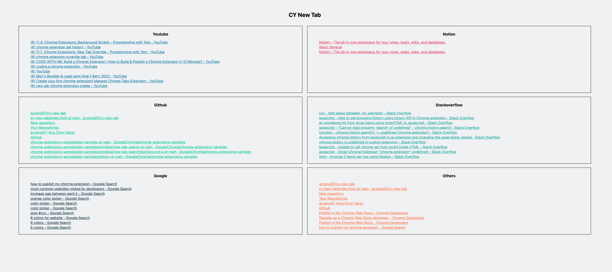

# CY New Tab

## Description

This is a chrome extension that I built that overrides the new tab when opening one on Chrome.

The new tab will display the most recent pages that the user has been to, grouping them by the website of the page. For now, the pages that will be grouped by are in one of the following websites:

- Youtube
- Notion
- Github
- Stackoverflow
- Linkedin
- Leetcode
- And a general 'Others'.

This will possibly be improved in the future so that pages can be categorized into more websites. Rationale for choosing the ones above is simply because they are the most common websites I have been visiting these days while preparing for a job.

Something similar to this was created for internal use back in Indeed. The rationale for me creating this is because I miss using it as it gives me a great overview of what I've been doing the past few hours. Sometimes, it also serves as a good reminder on going back to a page to finish up working on/ reading up on something

## How to set it up

- Currently, this is not yet available on the App Store as jobless me is stingy enough not to pay the $5 one time registration fee to register as a verified Chrome Developer
- Hence, if you are interested to use it, download the files in this repository into a folder -> Open `Manage Extensions` on Chrome -> Toggle Developer Mode to On -> Click `Load unpacked` -> Select the folder that you downloaded.
